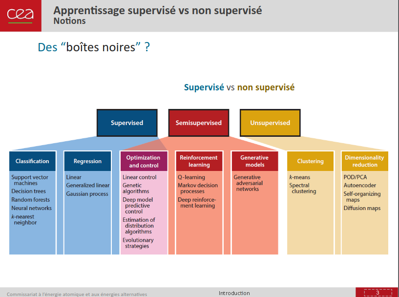

# Data-Science & Machine Learning

- [Cours de ML (année précédente)](https://github.com/0x14mth3n1ght/S3-Apprentissage_Automatique)



- Supervisé:

	- données étiquetées ((xi,yi)), 0<=i<=n -> *prédire* x* -> y*

	- classification (ex: `k-nn`) ou régression (modèle continu, discret)

- Non Supervisé

	- données non étiquetées ((xi)), 0<=i<=n ->  *regrouper* en classes : (x*,y*) 

	- partionnement (ex: `k-means`), regroupement hiérarchique
	

```bash
jupyter lab --no-browser --port 4444
http://localhost:4444/lab
```

https://fr.wikipedia.org/wiki/Apprentissage_non_supervis%C3%A9
